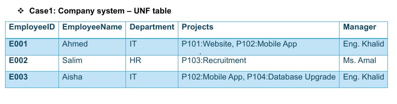
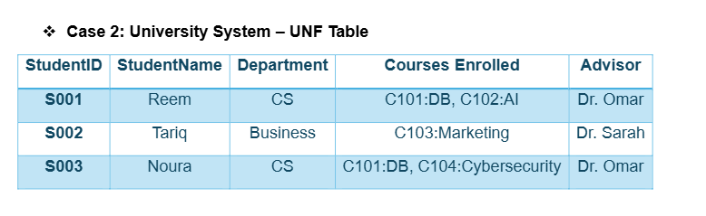
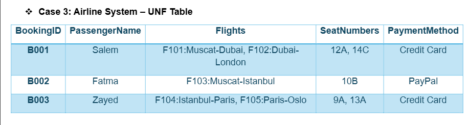
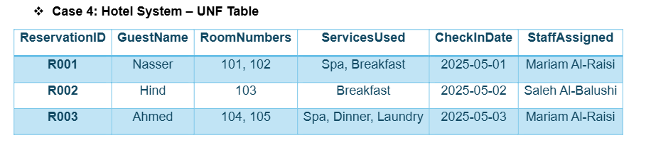

## Case1: Company system – UNF table 

| employee ID | Employee Name | Department | Manager     |
|-------------|---------------|------------|-------------|
| E001        |  Ahmed        | IT         | Eng. Khalid |
| E002        |  Salim        | HR         | Ms. Amal    |
| E003        |  Aisha        | IT         | Eng. Khalid |

| employee ID | Project          |
|-------------|------------------|
| E001        | P101             |
| E001        | Website          |
| E001        | P102             |
| E001        | Mobile App       |
| E002        | P103             |
| E002        | Recruitment      |
| E003        | P102             |
| E003        | Mobile App       |
| E003        |  P104            |
| E003        | Database Upgrade |

## Case 2: University System – UNF Table >

| student ID | Student Name | Department    | Advisor     |
|------------|--------------|---------------|-------------|
| S001       |  Reem        |     CS        | Dr. Omar    |
| S002       |  Tariq       |     Business  | Dr. Sarah   |
| S003       |  Noura       |     CS        | Dr. Omar    |

| student ID | Courses Enrolled   |
|------------|--------------------|
| S001       |  C101              |
| S001       |  DB                |
| S001       |  C102              |
| S001       |  AI                |
| S002       |  C103              |
| S002       |  Marketing         |
| S003       |  C102              |
| S003       |  DB                |
| S003       |  C104              |
| S003       |  Cybersecurity     |

| student ID | Student Name | 
|-------------|--------------|
| S001        |  Reem        |
| S002        |  Tariq       |
| S003        |  Noura       |

| student name | Department    | Advisor     |
|--------------|---------------|-------------|
| Reem         |     CS        |  Dr. Omar   |
| Tariq        |    Business   | Dr.  Sarah  |
| Noura        |     CS        |  Dr. Omar   |

| student name | Courses Enrolled   |
|--------------|--------------------|
| Reem         |  C101              |
| Reem         |  DB                |
| Reem         |  C102              |
| Reem         |  AI                |
| Tariq        |  C103              |
| Tariq        |  Marketing         |
| Noura        |  C101              |
| Noura        |  DB                |
| Noura        |  C104              |
| Noura        |  Cybersecurity     |

## Case 3: Airline System – UNF Table

| BookingID | PassengerName | PaymentMethod | 
|-----------|---------------|---------------|
| B001      |  Salem        | Credit Card   |
| B002      |  Fatma        | PayPal        |
| B003      |  Zayed        | Credit Card   |

| BookingID | Flights         |
|-----------|-----------------|
| B001      | F101            |
| B001      | Muscat-Dubai    |
| B001      |  F102           |
| B001      | Dubai-London    |
| B002      | F103            |
| B002      | Muscat-Istanbul |
| B003      | F104            |
| B003      | Istanbul-Paris  |
| B003      | F105            |
| B003      | Paris-Oslo      |

| BookingID | SeatNumbers |
|-----------|-------------|
| B001      | 12A         |
| B001      | 14C         |
| B002      | 10B         |
| B003      | 9A          |
| B003      | 13A         |

## Case 4: Hotel System – UNF Table 

| ReservationID  |  GuestName  |  CheckInDate  |  StaffAssigned    |
|----------------|-------------|---------------|-------------------|
| R001           |  Nasser     |  2025-05-01   |  Mariam Al-Raisi  |
| R002           |  Hind       |  2025-05-02   |  Saleh Al-Balushi |
| R003           |  Ahmed      |  2025-05-03   |  Mariam Al-Raisi  |

| ReservationID  | RoomNumbers      |
|----------------|------------------|
| R001           | 101              |
| R001           | 102              |
| R002           | 103              |
| R003           | 104              |
| R003           | 105              |

| ReservationID  |ServicesUsed     |	
|----------------|-----------------|
| R001           |  Spa            |
| R001           |  Breakfast      |
| R002           |   Breakfast     |
| R003           |  Spa            |
| R003           |  Dinner         |
| R003           |  Laundry        |

